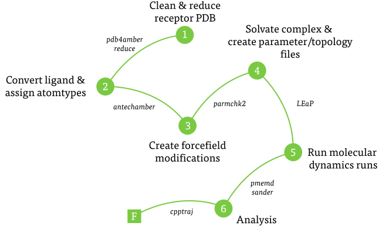
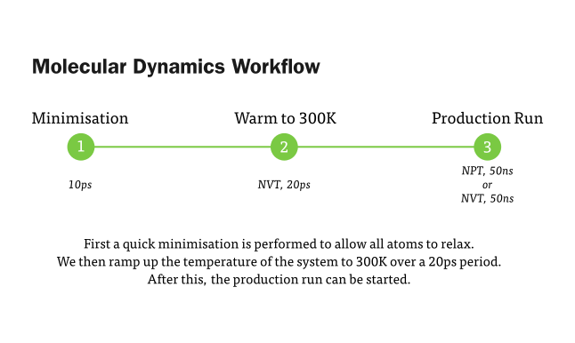
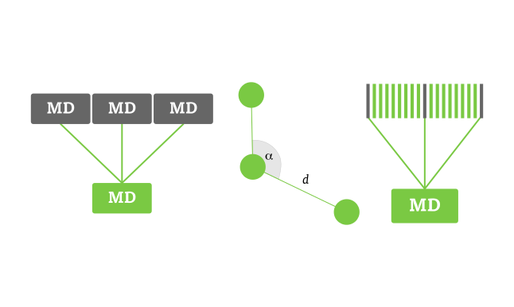

#Amber Workflow
Note: [Amber](http://ambermd.org) is commercial software.



## Cleaning the Receptor

The only required or useful data in a PDB file to set up AMBER simulations are: atom names, residue names, and maybe chain identifiers (if more than one chain is present), and the coordinates of heavy atoms

Most of the recommended steps to clean a system can be achieved with the `pdb4amber` and `reduce` programs, although don't use these commands like a blindly! Inspect the output to make sure it is as you need it (some general pointers are below).

```bash
# Preparing the receptor PDB file
pdb4amber -i rec.pdb -o rec.noh.pdb --nohyd --dry
reduce -build -nuclear rec.noh.pdb > rec.cleaned.pdb
```

### Bit more detail 
Delete everything but the necessary info: ATOM and HETATM lines, TER lines etc. `pdb4amber` strips PDB files of all unnecessary information. It does keep other stuff, but splits them into filenames ending with `_nonprot.pdb`, `_water.pdb` and `_sslink.pdb`.

If there is a ligand present (i.e. it was present in the crystal structure) delete it. We need to deal with that later. 
 
Some waters might be essential for ligand binding. If those waters are kept, they should be made part of the receptor (as distinct "residues"), not of the ligand. leap recognizes water if the residue name is WAT or HOH.

Make use of "TER" records to separate parts in the PDB file which are not connected covalently.

We need to delete all peptide hydrogens before running `reduce`.You can do this in programs such as chimera or pymol, if `pdb4amber` does not work correctly. `reduce` will re-add hydrogens where required, with standard bond lengths etc.

*Note these are only a few general pointers. The Amber reference manual has much more detail: pages around 185 are good to start with.*

## Antechamber 

**Antechamber** is the main program to develop force fields for drug-like molecules or modified amino acids using the general Amber force field (GAFF). These can be used directly in LEaP, or can serve as a starting point for further parameter development.

We have a receptor file ready to use, now it is time for the ligands. `antechamber` can perform many file conversions, and can also assign atomic charges and atom types.

It has a lot of different input and output types, including config files for gaussian if you want to use a qm program to calculate charges.

```bash
# Converting the ligand PDB to mol2 with correct atom types etc.
antechamber -i lig.pdb -fi pdb -o lig.ante.mol2 -fo mol2 -c bcc
```

### Doctor Doctor!

Amber has recently introduce `acdoctor`, which, if you come into problems using your converted ligand file later, can help to diagnose any problems caused by the conversion.

```bash
# Checking if there are problems
acdoctor -i lig.ante.mol2 -f mol2
```

## Parmchk2

**Parmchk2** is a program that analyzes an input force field library file (mol2 or amber prep), and extracts relevant parameters into an frcmod file.

`parmchk2` reads in an ac/**mol2**/prepi/prepc file and writes out a force field modification (**frcmod**) file containing any force field parameters that are needed for the molecule but not supplied by the force field (*.dat) file. Problematic parameters, if any, are indicated in the frcmod file with the note, “ATTN, need revision”, and are typically given values of zero.

```bash
# Creating forcefield modifications 
parmchk2 -i lig.ante.mol2 -f mol2 -o lig.frcmod
```
*Note, `parmchk2` replaces the `parmchk` program found in <= Amber v13.*

## LEaP

**LEaP** is the primary program to create a new system in Amber, or to modify existing systems. It combines the functionality of prep, link, edit and parm from much earlier versions of Amber.

There are two modes: 
* **tLEaP**, which does not require an X-window and is purely shell based.
* **xLEaP**, which *does* require an X-window, and is GUI based.

The same commands are ran in both modes.

You can run the following script using `tleap -s -f tleap.in`, or by entering each command in individually.

```bash
# Load the parameter files for proteins 
# and small organic molecules
source leaprc.ff99SB
source leaprc.gaff

# Load the ligands, receptors and combine them
# Run the ligand through antechamber first 
# so atom types are correct
LIG = loadmol2 lig.ante.mol2
REC = loadpdb rec.cleaned.pdb
COM = combine {LIG REC}

# Load the amberparams for the ligand
# You can obtain these by using parmchk2
loadamberparams lig.frcmod

# Just printing out the total charge to check how to neutralise
charge COM

# Add Na+ so we neautralise the complex (note you might
# need to use Ca-!!!)
addions COM Na+ 0

# Make an octrahedral container with a "radius" of 10Å
solvateoct COM TIP3PBOX 10

# Save the parameter files for the solvated complex, and
# a PDB so we can view it in visualisation programs
saveamberparm COM lig.com.solv.prmtop lig.com.solv.inpcrd
savePdb COM lig.com.solv.pdb

# We are finished, so quit LEaP
quit
```

## Slurm

For preparation of systems, you can do this either on a server/cluster or even on your own workstation. For the actual MD runs, though, you need to run them on a cluster. Queue managers are often used to balane tasks across the cluster, and slurm is one example of this. 
```bash
#!/bin/bash
#
#
#SBATCH --gres=gpu:4
#SBATCH --ntasks=4
#SBATCH --exclusive
#SBATCH --mem-per-cpu=3000
#SBATCH --time=10-10:0:0

echo ""
echo "DESCRIPTION"
echo "-------------------------------------"
echo ""

mpiexec  -n 4 $AMBERHOME/bin/pmemd.cuda.MPI \
		 -O -i CONF.in \
		 -o LOG.out \
		 -p LIG.prmtop \
		 -c LIG.inpcrd \
		 -x MD.mdcrd \
		 -inf MD.mdinfo \
		 -r MD.restrt
``` 

## MD


The followng scripts are for the actual molecular dynamics runs. They are largely use-as-is, so I won't describe them.

### Minimisation
```bash
Minimisation of complex
 &cntrl
  imin=1, maxcyc=10000, ncyc=5000,
  cut=12, ntb=1, igb=0, ntr=0
 /
END
END
```
### First MD Run (NVT, 20ps)
```bash
MD heating 0 to 300K over 20 ps at CONSTANT VOLUME,  no shake
 &cntrl
  imin   = 0,
  irest  = 0,
  ntx    = 1,
  ntb    = 1,
  cut    = 12,
  ntr    = 0,
  ntc    = 1,
  ntf    = 1,
  igb    = 0
  tempi  = 0.0,
  temp0  = 300.0,
  ntt    = 3,
  gamma_ln = 1.0,
  nstlim = 20000, dt = 0.001
  ntpr = 10000, ntwx = 10000, ntwr = 10000
/
END
END
```
### Second MD Run (NPT, 50ns)
```bash
MD run const pressure NO SHAKE
 &cntrl
  imin   = 0,
  irest  = 1,
  ntx    = 7,
  ntb    = 2,
  cut    = 12,
  ntr    = 0,
  ntc    = 1,
  ntf    = 1,
  igb    = 0
  ntp    = 1
  tempi  = 300.0,
  temp0  = 300.0,
  ntt    = 3,
  gamma_ln = 1.0,
  nstlim = 5000000, dt = 0.001
  ntpr = 10000, ntwx = 10000, ntwr = 10000
/
END
END
```
### Alternative Second MD Run (NVT, 50ns)
```bash
MD run const VOLUME WITH SHAKE at 300K
 &cntrl
  imin   = 0,
  irest  = 1,
  ntx    = 7,
  ntb    = 1,
  cut    = 12,
  ntr    = 0,
  ntc    = 2,
  ntf    = 2,
  igb    = 0
  ntp    = 0
  tempi  = 300.0,
  temp0  = 300.0,
  ntt    = 1,
  gamma_ln = 0,
  nstlim = 25000000, dt = 0.002
  ntpr = 12500, ntwx = 12500, ntwr = 12500
/
END
END
```
## Analysis



### Combine MD runs
```bash
trajin md1.mdcrd
trajin md2.mdcrd
trajin md3.mdcrd
trajin md4.mdcrd
trajout md.combined.mdcrd
```
### Shorten MD run
```bash
trajin md.combined.mdcrd 1 10002 10
trajout md.shortened.mdcrd
```
### RMSD
```bash
trajin md.shortened.mdcrd
average average.pdb pdb
rms first out rms_first.dat  :1-349@N,C,CA
```
### Distance
```bash
trajin md.shortened.mdcrd
distance end_to_end :350@HC1 :51@HG out oh_h2.list
```

### Process_MDOut

[Download](process_mdout.pl).

Use:

```bash
perl process_mdout.pl MD.out
```