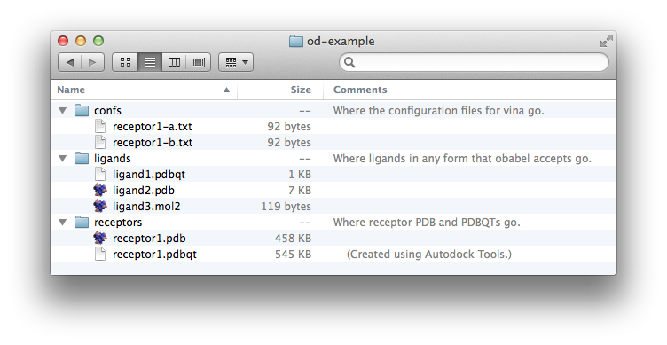

# Using OpenDiscovery

## Basic setup

Once installed, OpenDiscovery is easy to use. First we need to set up the directory in which all the files are located for OpenDiscovery to use. 



There should be **three** folders. The names of these folders are important.

### Ligands Folder
The name of this folder must be **ligands**.

In here, place files that you wish to be docked against each receptor. The only real restriction is that they must be a format which open babel can convert from. To skip conversion, *PDBQT*s are required and the quickest way to get the docking going.

### Receptors folder
The name of this folder must be **receptors**.

In here, place the receptors that you wish to have the ligands docked against. For every receptor, a PDB **and** PDBQT format must be provided, with the same name. While there are other ways of obtaining PDBQTs, the usual way is to use AutoDock Tools.

### Confs folder
The name of this folder must be **confs**.

This folder should contain text files (i.e. something**.txt**), and they must correspond with a receptor. Conf files are associated with their receptor files by starting their name with the same name (without .PDB or .PDBQT), followed by a unique identifier if you wish.

## Running OpenDiscovery
Although OpenDiscovery is configurable and runnable through python code, the most common method of running OpenDiscovery is through its binary.

You need to know 2 things:
* the path to the directory you created above
* the exhaustiveness of the docking you wish to perform

With these two pieces of information in mind, open up a terminal and run OpenDiscovery by typing:

```bash
# running opendiscovery!
odscreen -d YOURPATHHERE -e YOUREXHAUSTIVENESSHERE

# for example
odscreen -d ~/Desktop/opendiscovery-example -e 500
```